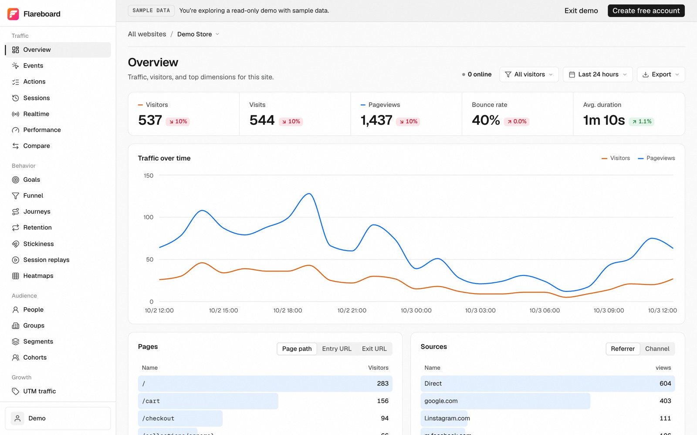
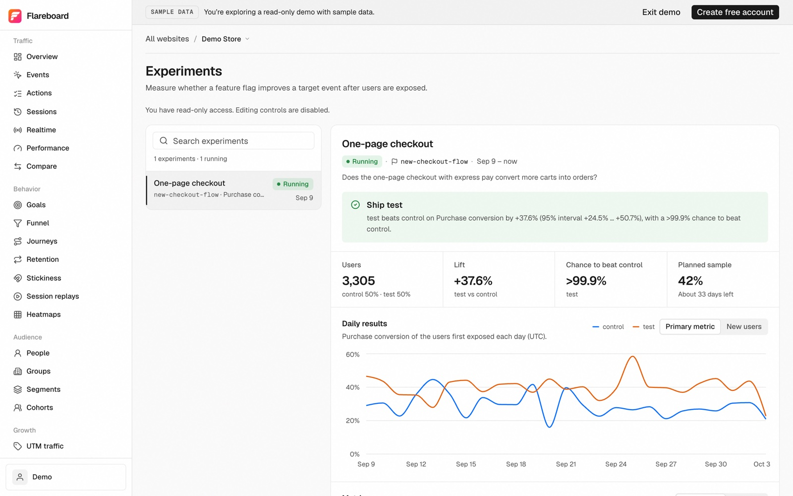

Flareboard is open for sign-ups. It covers events and funnels, session replay, feature flags, experiments and error tracking, and it runs entirely on Cloudflare: Workers, Durable Objects, D1, R2, KV and Queues. There is no ClickHouse cluster behind it, no Kafka and no Kubernetes.

You can open the [live demo](https://flareboard.dev/demo) without signing up. It is a read-only account with a sample online store and a docs site, and its data is refreshed every day. When you want your own numbers, [create a free account](https://flareboard.dev/register) and add the tracking script. Events show up within seconds.



## Why we built it

Analytics tools that do more than count pageviews usually sit on a columnar database such as ClickHouse. It is a good engine. It is also the reason that self-hosting those tools means operating ClickHouse, Kafka and the services around them.

We wanted the same product on a platform that many web teams already deploy to. Cloudflare has the parts. Workers receive events close to your visitors, Queues absorb traffic spikes, R2 keeps replay recordings and Durable Objects hold the data.

## Every website gets its own database

Each website you add gets its own SQLite database inside its own Durable Object. Events, sessions, people, logs and rollups for that site live there and nowhere else.

A busy store and a quiet blog never share tables, so one cannot slow down the other. A report is a query against one site's data, not a scan across every customer. Deleting a website removes its database for good after a 30-day grace period.

## What's in it

**Analytics.** Overview, events, sessions, realtime, funnels, journeys, retention, stickiness, cohorts, UTM, attribution and revenue. Flareboard reports Web Vitals at the 75th percentile, the way Google assesses them. Save what you find as insights, boards or notebooks.

**Replay and heatmaps.** Flareboard stores session recordings in R2 and masks form inputs by default. Click and scroll heatmaps show what people do on each page.

**Flags and experiments.** Feature flags support targeting rules, percentage rollouts, variants and JSON payloads. An experiment reads its results from flag exposures and gives you a decision with the lift, a 95% interval and the chance that the variant beats control.



**Surveys and workflows.** NPS, CSAT and open-text surveys on your pages. Workflows react to an event, wait, branch, and then call a webhook, send an email or post to Slack.

**Errors, logs and LLM calls.** Errors group into issues with source maps and alerts. Logs and traces arrive over OTLP, the OpenTelemetry protocol. Flareboard tracks the cost, tokens and latency of each LLM call.

**SQL, exports and MCP.** Run read-only SQL over your events, export CSV, or connect Claude, Cursor or any other MCP client to the built-in MCP server with a personal API key.

## Privacy by default

The tracker does not use cookies. Flareboard counts visitors with a hash of the IP address and user agent, salted with a value that changes every month, and it never stores IP addresses.

To recognize returning visitors across months, turn on "Remember visitors across sessions" for a website. The tracker then keeps a random ID in localStorage, and you can hold it back until a visitor consents. Autocapture records clicks and form submissions but never what someone typed.

## Add it to your site

Paste one script tag:

```html
<script defer src="https://t.flareboard.dev/script.js" data-website-id="YOUR_WEBSITE_ID"></script>
```

Or install the npm package. It is typed, queues calls until the script has loaded and comes with React hooks for feature flags.

```bash
npm install @flareboard/js
```

```ts
import { flareboard } from '@flareboard/js';

flareboard.init({ host: 'https://t.flareboard.dev', websiteId: 'YOUR_WEBSITE_ID' });
flareboard.track('signup', { plan: 'pro' });
```

The package is MIT-licensed, so you can ship it in any project, commercial or not. If you already use PostHog's SDKs, you can point them at Flareboard by changing the API key and host. The [compatibility guide](/docs/install/posthog) has the details.

## Pricing

| Plan | Price | Events per month | Replays per month | Data kept |
| --- | --- | --- | --- | --- |
| Free | $0 | 100,000 | none | 1 year |
| Cloud | $19/month | 1,000,000 | 5,000 | 2 years |
| Business | $99/month | 5,000,000 | 25,000 | 3 years |

The free plan covers one website with analytics, reports, errors and logs. Cloud and Business add unlimited websites, session replay, heatmaps, flags and experiments, surveys, teams and SQL. The [pricing page](https://flareboard.dev/pricing) has the full comparison.

## The source

The code is on [GitHub](https://github.com/Go7hic/flareboard). The server and dashboard use the PolyForm Noncommercial license, so you can run your own copy on your Cloudflare account for personal and other noncommercial use. The SDK is MIT.

## Try it

- Open the [live demo](https://flareboard.dev/demo). No sign-up needed.
- [Create a free account](https://flareboard.dev/register) and add your first website.
- Tell us what is missing at [support@flareboard.dev](mailto:support@flareboard.dev).
