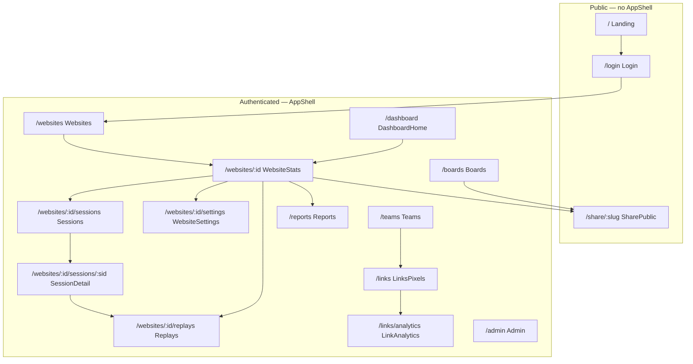
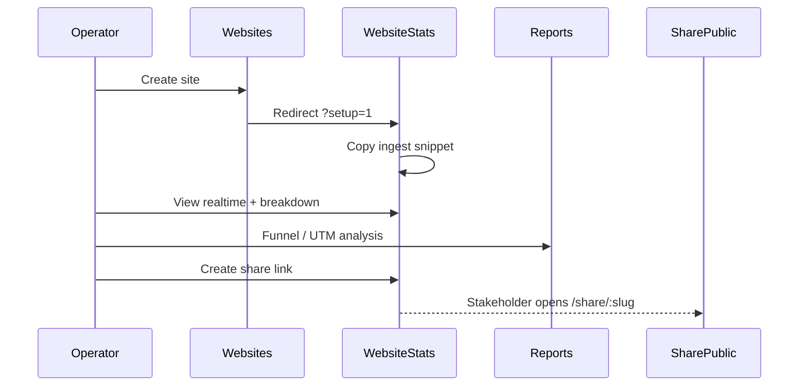

# Flareboard Dashboard — UX Design Specification

Design-only document for the authenticated dashboard layout pass. Describes information architecture, per-route wireframes, global UI patterns, and a phased rollout plan. **No API or route changes** — layout and interaction guidance only.

**Related:** [`AGENTS.md`](../../AGENTS.md) (design tokens), [`DESIGN-NOTE.md`](./DESIGN-NOTE.md) (brand audit), [`src/App.tsx`](./src/App.tsx) (routes).

---

## Implementation status

| Phase | Scope | Status |
|-------|-------|--------|
| **Phase 1** | Website stats + Reports layout | **Partial — shipped in commit `379909b`** |
| Phase 2 | Remaining authenticated routes | Shipped (layout pass) |
| **Phase 3** | Polish, responsive, a11y pass | **Complete** |

### What `379909b` already delivers (Phase 1 partial)

Commit `379909b` (`feat(dashboard): redesign stats and reports layout UX`) introduced:

- **`PageHeader` toolbar slot** — date range and filters live below the title row, not inline with actions.
- **`WebsiteStats` (`page-stats`)** — `analytics-hero` panel (stat strip + hero chart), `stats-toolbar` (range, segment, compare, CSV exports), `breakdown-panel` with metric tabs, `CollapsibleSection` for share/segments/events.
- **`Reports` (`page-reports`)** — two-column `reports-layout` (sticky sidebar config + scrollable `ReportSection` stack).
- **Shared primitives** — `CollapsibleSection`, `EmptyState`, refreshed `DateRangePicker`, `MetricsTable` (embedded + inline bars), `ReportSection`, new CSS in `global.css`.

Phase 2 should **reuse these primitives** on other routes rather than inventing parallel patterns.

---

## Product principles

1. **Operator-first density** — stat grids, tables, mono numerics; predictable nav; minimal decoration (VISUAL_DENSITY 7 per `DESIGN-NOTE.md`).
2. **Flat solids only** — no gradients; hierarchy via typography, spacing, 1px borders, accent rails, light shadows.
3. **Geist gray primary, blue focus** — `--accent` / `--primary` for CTAs (gray-1000); `--link` / focus rings for Geist blue; `--cf-orange` for CF callouts only.
4. **Consistent shell** — every authenticated view shares `AppShell` header; sub-routes use `PageHeader` with optional back link, actions, and toolbar.
5. **Progressive disclosure** — hero metrics and charts above the fold; advanced config (share links, segments, admin) in collapsible or secondary panels.
6. **i18n-ready** — all copy via `t(key)`; five locales (`en-US`, `zh-CN`, `ja-JP`, `de-DE`, `fr-FR`).

---

## Information architecture

### Route map



### Primary nav (AppShell)

| Nav item | Path | Role |
|----------|------|------|
| Dashboard | `/dashboard` | Cross-site overview |
| Websites | `/websites` | Site list + create |
| Teams | `/teams` | Collaboration |
| Links | `/links` | Short links & pixels |
| Reports | `/reports` | Funnels, vitals, UTM, revenue |
| Boards | `/boards` | Custom widget dashboards |
| Admin | `/admin` | Instance administration |

Brand logo links to `/websites` (primary operator entry). Header end: **locale → theme → logout**.

### Website sub-navigation (contextual)

Reached from `WebsiteStats` header actions — not global nav:

| Action | Path |
|--------|------|
| Sessions | `/websites/:id/sessions` |
| Settings | `/websites/:id/settings` |
| Session replays | `/websites/:id/replays` |

---

## Global patterns

### App shell

```
┌──────────────────────────────────────────────────────────────────────────┐
│ [Logo→/websites]  Dashboard Websites Teams Links Reports Boards Admin   │
│                                      [Locale] [Theme] [Logout]           │
├──────────────────────────────────────────────────────────────────────────┤
│                                                                          │
│  .page (max 1240px, 1.75rem / 1.5rem padding)                            │
│                                                                          │
└──────────────────────────────────────────────────────────────────────────┘
```

- Sticky `.shell-nav` with `--shell-bg` + `backdrop-filter`.
- Active nav: `.shell-link.active` inset accent bar.
- Auth guard redirects to `/login` when token missing.

### PageHeader (authenticated pages)

```
← Back (optional)
┌─────────────────────────────────────────────────────────────┐
│ Title                                    [Action] [Action]  │
│ Subtitle                                                    │
├─────────────────────────────────────────────────────────────┤
│ Toolbar: DateRangePicker | filters | exports                │
└─────────────────────────────────────────────────────────────┘
```

Slots: `backTo` / `backLabel`, `actions` (btn-sm secondary cluster), `toolbar` (full-width row below copy).

### Layout primitives (reuse everywhere)

| Primitive | Class / component | Use |
|-----------|-------------------|-----|
| Page container | `.page` | All authenticated content |
| Panel | `.panel` | Form blocks, tables, config |
| Stat card | `.stat-card`, `.stat-card-primary` | KPI strip; primary uses gray accent rail |
| Section title | `.section-title` | H2 within panels |
| Data table | `.data-table` + `.table-scroll` | Tabular metrics |
| Empty state | `.empty-state-rich` | Numbered steps or CTA |
| Chart wrap | `.chart-wrap`, `.chart-wrap-hero`, `.chart-wrap-compact` | Recharts containers |
| Report block | `ReportSection` | Reports + future analytics sections |
| Collapsible | `CollapsibleSection` | Advanced / infrequent controls |
| Skeleton | `.skeleton` | Loading placeholders |

### Date & filter toolbar (target pattern)

Established in Phase 1 (`stats-toolbar`, Reports sidebar):

```
[DateRangePicker: 24h | 7d | 30d | custom]
[Segment ▼]  [☐ Compare]  [Export CSV ×2]
```

Apply this pattern to Sessions, LinkAnalytics, and (optionally) DashboardHome in Phase 2.

### Responsive breakpoints (target)

| Breakpoint | Behavior |
|------------|----------|
| ≥1024px | Full nav labels; `reports-layout` sidebar + main; `analytics-hero-stats` 5-column |
| 768–1023px | Nav may wrap; stat grid 3+2; reports sidebar stacks above main |
| <768px | Shell nav scrolls horizontally; stat grid 2-col; tables scroll; form-rows stack |

Phase 3 owns full responsive QA; wireframes below show desktop-first (1240px).

### Theme & tokens

All colors via CSS variables in `global.css` — see `AGENTS.md`. Charts use `useChartColors()` for theme-aware strokes/fills.

---

## Route specifications

### `/` — Landing (public)

**Purpose:** Marketing conversion; GA-on-Cloudflare positioning.

**Layout:** Full-bleed marketing shell (no AppShell). Sticky nav with logo, theme toggle, Get started → `/login`.

```
┌─────────────────────────────────────────┐
│ Nav: Logo · Theme · [Get started]       │
├─────────────────────────────────────────┤
│ Hero: badge + headline + pipeline visual  │
│ [Get started]                           │
├─────────────────────────────────────────┤
│ Why not GA? (comparison strip)          │
│ Cloudflare stack grid                   │
│ Features bento (4 cells, accent rails)  │
│ Trust band + CTA                        │
└─────────────────────────────────────────┘
```

**Phase:** Out of scope for layout pass (already taste-skill treated per `DESIGN-NOTE.md`). Do not regress landing when editing dashboard CSS.

---

### `/login` — Login (public)

**Purpose:** Authenticate; support OAuth, forgot/reset password; redirect to `/websites`.

```
┌──────────────────────────┐
│ Logo          [Theme]    │
│                          │
│   ┌──────────────────┐ │
│   │ CF Workers badge   │ │
│   │ Sign in            │ │
│   │ username           │ │
│   │ password           │ │
│   │ [Continue]         │ │
│   │ Forgot · OAuth     │ │
│   │ ← Back to marketing│ │
│   └──────────────────┘ │
└──────────────────────────┘
```

**States:** `login` | `forgot` | `reset` (token in query). Token handoff via `?token=` auto-redirects.

**Phase 2:** Align error/message spacing with `.field` rhythm; remove inline `style` margins where possible.

---

### `/dashboard` — DashboardHome

**Purpose:** Cross-website snapshot — pageviews and visitors per site.

**Current gaps:** No date range; simpler cards than `WebsiteStats` hero; no `PageHeader` toolbar.

**Target wireframe:**

```
PageHeader: Dashboard | subtitle
┌─ site card ─────────────┐ ┌─ site card ─────────────┐
│ Site name               │ │ Site name               │
│ domain                  │ │ domain                  │
│ [pageviews] [visitors]  │ │ [pageviews] [visitors]  │
└─────────────────────────┘ └─────────────────────────┘
```

Empty: `.empty-state-rich` + CTA → `/websites`.

**Phase 2:** Unify site cards with `.site-card` pattern from `/websites`; optional global date preset in toolbar.

---

### `/websites` — Websites

**Purpose:** List properties; create new site (redirects to stats with `?setup=1`).

```
PageHeader: Websites | subtitle
┌─ panel: Add website ─────────────────────────────┐
│ name · domain · [Create]                         │
└──────────────────────────────────────────────────┘

┌─ site card ──→┐  ┌─ site card ──→┐
│ Name          │  │ Name          │
│ domain        │  │ domain        │
└───────────────┘  └───────────────┘
```

Empty: numbered `.empty-state-steps` (3 steps).

**Phase 2:** Keep create form in panel; consider collapsing create form after first site (open question).

---

### `/websites/:websiteId` — WebsiteStats ★ Phase 1 reference

**Purpose:** Primary operator analytics view.

**Implemented layout (`379909b`):**

```
PageHeader: Site name | domain
  actions: [Sessions] [Settings] [Replays]
  toolbar: DateRange · Segment · Compare · Export

[IngestSnippetPanel — setup only]
[RealtimeWidget]

┌─ analytics-hero panel ────────────────────────────────┐
│ [PV★] [Visitors] [Visits] [Bounces] [Total time]      │
│ (compare strip when enabled)                          │
│ Pageviews over time — hero line chart                 │
└───────────────────────────────────────────────────────┘

[Revenue summary — if data]

┌─ breakdown-panel ───────────────────────────────────┐
│ Breakdown metrics | [path|referrer|country|…] tabs    │
│ [Country map — if mapbox]                             │
│ MetricsTable (embedded, inline bars)                  │
└───────────────────────────────────────────────────────┘

[Custom events — MetricsTable]

▼ CollapsibleSection: More details
   EventDataPanel · SegmentsPanel · ShareManage · Create share
```

**Phase 3:** Retention cohort heatmap styling; mobile metric-tab scroll; map fallback copy.

---

### `/websites/:websiteId/sessions` — Sessions

**Purpose:** Browse sessions in date range; drill to detail.

```
PageHeader: Sessions | back → stats
  action: [Settings]

┌─ panel ──────────────┐
│ DateRangePicker      │
└──────────────────────┘

│ Country · City          browser/os/device · views    lastAt │
│ Country · City          ...                               │
```

Empty: `noSessionsInRange`.

**Phase 2:** Move `DateRangePicker` to `PageHeader.toolbar` (match stats). Replace plain list with `.data-table` or structured `.list-row` cards; add pagination affordance (API supports `pageSize=50`).

---

### `/websites/:websiteId/sessions/:sessionId` — SessionDetail

**Purpose:** Single-session metadata, activity timeline, custom properties.

```
PageHeader: Session | id prefix | back → sessions

┌─ panel: Session info (kv rows) ──────┐
│ location · device · language · id    │
│ [View replays]                       │
└──────────────────────────────────────┘

┌─ panel: Activity ──────────────────┐
│ [event] /path — timestamp            │
└──────────────────────────────────────┘

┌─ panel: Properties (if any) ─────────┐
│ key — value                          │
└──────────────────────────────────────┘
```

**Phase 2:** Use `.kv-grid` for session info (parity with Reports vitals). Activity as vertical timeline with mono timestamps.

---

### `/websites/:websiteId/settings` — WebsiteSettings

**Purpose:** Replay toggle + JSON config; stats reset datetime.

```
PageHeader: Settings | back → stats

┌─ panel (form) ───────────────────────┐
│ Session replay                       │
│ ☑ Enable                             │
│ [replayConfig JSON textarea]         │
│ ─────────────────                    │
│ Stats reset                          │
│ [datetime-local]                     │
│ [Save settings]                      │
└──────────────────────────────────────┘
```

**Phase 2:** Split into two `.panel` sections with accent rail; validate JSON inline before submit; danger styling on reset field.

---

### `/websites/:websiteId/replays` — Replays

**Purpose:** List visits; play rrweb recording inline.

```
PageHeader: Session replays | site name | back → stats

┌─ panel: Visits grid ─────────────────┐
│ [visit cards — selectable]           │
└──────────────────────────────────────┘

┌─ player area ────────────────────────┐
│ rrweb-player (max 1024×576)          │
└──────────────────────────────────────┘
```

**Phase 2:** Master-detail split on desktop (list left, player right); empty state when replay disabled in settings with link to settings.

---

### `/teams` — Teams

**Purpose:** Create/join teams; manage members, team websites; link to scoped links/pixels.

```
PageHeader: Teams | subtitle

┌─ Create team ─┐  ┌─ Join with code ─┐
│ name [Create] │  │ code [Join]      │
└───────────────┘  └──────────────────┘

┌─ team cards (selectable) ────────────┐

┌─ selected team detail panel ─────────┐
│ Members (role select, remove)        │
│ Access code (copy)                   │
│ Team websites list                   │
│ Add team website form                │
│ → Links & pixels (?teamId=)          │
└──────────────────────────────────────┘
```

**Phase 2:** Convert to master-detail layout (`grid-2` → sidebar list + detail pane). Hide access-code/member controls for non-managers via existing `canManageTeam`.

---

### `/links` — LinksPixels

**Purpose:** CRUD short links and 1×1 tracking pixels; team scope filter.

```
PageHeader: Links & pixels | subtitle

┌─ panel: Team scope [select] ─────────┐

┌─ panel: Short links ─────────────────┐
│ name · url · [Create]                │
│ list: name → url [View stats]        │
│       ingest URL /l/{slug}           │
└──────────────────────────────────────┘

┌─ panel: Tracking pixels ─────────────┐
│ name · [Create]                      │
│ list: img snippet                    │
└──────────────────────────────────────┘
```

**Phase 2:** Tabbed or stacked panels with copy-to-clipboard on slug/snippet; unify list rows with `.list-item-row`.

---

### `/links/analytics` — LinkAnalytics

**Purpose:** Per-link clicks, uniques, time series.

```
PageHeader: Link analytics | back → links

┌─ panel: Link picker [select] ────────┐

┌─ link meta panel ────────────────────┐
│ name · url · slug                    │
└──────────────────────────────────────┘

DateRangePicker
[clicks] [unique visitors]  — stat cards
┌─ panel: Clicks over time (line) ─────┐
```

**Phase 2:** Apply `analytics-hero` pattern from WebsiteStats (stat strip + chart in one panel); toolbar in PageHeader.

---

### `/reports` — Reports ★ Phase 1 reference

**Purpose:** Multi-report workspace — funnel, retention, journey, attribution, breakdown, vitals, UTM, revenue, goals.

**Implemented layout (`379909b`):**

```
PageHeader: Reports | back → websites
  toolbar: DateRangePicker

┌─ reports-layout ─────────────────────────────────────────────┐
│ SIDEBAR (sticky)          │ MAIN (scroll)                    │
│ ┌─ report config ─────┐   │ ReportSection: Funnel + chart    │
│ │ Website [select]    │   │ ReportSection: Retention         │
│ │ Segment [select]    │   │ ReportSection: User journeys     │
│ │ Saved reports       │   │ ReportSection: Attribution       │
│ │ Funnel steps input  │   │ ReportSection: Country breakdown │
│ └─────────────────────┘   │ ReportSection: Web vitals (kv)   │
│                           │ ReportSection: UTM (data-table)  │
│                           │ ReportSection: Revenue           │
│                           │ ReportSection: Goals             │
└──────────────────────────────────────────────────────────────┘
```

**Phase 3:** Retention cohort table/heatmap; saved-report click loads parameters into sidebar; section anchor nav in sidebar.

---

### `/boards` — Boards

**Purpose:** Build custom stat widget boards; share public read-only view.

```
PageHeader: Boards | back → websites

┌─ panel: New board ───────────────────┐
│ BoardEditorForm (widgets)            │
└──────────────────────────────────────┘

┌─ board card ─────────────────────────┐
│ name + BoardWidgets preview          │
│ [Share] [Copy] [Edit] [Delete]       │
│ share URL                            │
└──────────────────────────────────────┘
```

Empty: `.empty-state-rich`.

**Phase 2:** Grid of board cards (2-col); inline edit expands card; widget preview uses same chart panel styles as stats.

---

### `/admin` — Admin

**Purpose:** Instance admin — users, teams, websites, audit, CSV export. Gated by role.

```
PageHeader: Admin | back → websites

Forbidden → empty-state-rich (admin required)

┌─ Export data ────────────────────────┐
│ [users] [websites] [events + id]     │
└──────────────────────────────────────┘

┌─ Users (create + list + inline edit) ┐
┌─ Teams (read-only list)              ┐
┌─ All websites                        ┐
┌─ Audit log                           ┐
```

**Phase 2:** Tabbed sections or vertical nav within page; audit log as `.data-table` with pagination; export block as compact toolbar panel.

---

### `/share/:slug` — SharePublic (public)

**Purpose:** Read-only stats for website or board share links; no auth.

```
┌─ Brand logo ─────────────────────────┐
│ Title (site or board name)           │
│ Shared: {share name}                 │
│ [24h] [7d] [30d]                     │
├──────────────────────────────────────┤
│ Website: stats + chart OR            │
│ Board: BoardWidgets (publicMode)     │
└──────────────────────────────────────┘
```

**Phase 2:** Add read-only badge; match `analytics-hero` chart panel for website shares; minimal header (no AppShell).

---

## Cross-route user flows



---

## Three-phase implementation plan

### Phase 1 — Analytics core (partial ✓)

**Routes:** `WebsiteStats`, `Reports`

**Deliverables (done in `379909b`):**

- [x] `PageHeader` toolbar pattern
- [x] `analytics-hero` + `stats-toolbar`
- [x] `reports-layout` sidebar + `ReportSection` stack
- [x] `EmptyState`, `CollapsibleSection`, `MetricsTable` refresh
- [x] Chart wrappers and skeleton loading

**Remaining Phase 1 polish (optional before Phase 2):**

- [ ] Retention cohort visual (currently meta count only)
- [ ] Saved report row → hydrate funnel steps on click
- [ ] Compare mode empty/error states

### Phase 2 — Route parity

Apply Phase 1 primitives to all other authenticated routes.

| Priority | Routes | Key changes |
|----------|--------|-------------|
| P0 | `Sessions`, `SessionDetail`, `LinkAnalytics` | Toolbar date range; hero stat+chart layout |
| P0 | `Websites`, `DashboardHome` | Unified site cards; consistent empty states |
| P1 | `WebsiteSettings`, `Replays` | Split panels; master-detail replay |
| P1 | `Teams`, `LinksPixels` | Master-detail / tabbed panels |
| P1 | `Boards` | Card grid; chart parity in widgets |
| P2 | `Admin` | Table audit log; section tabs |
| P2 | `SharePublic` | Read-only badge; hero chart parity |
| — | `Login`, `Landing` | Spacing token cleanup only |

**Exit criteria:** Every authenticated route uses `PageHeader` consistently; no one-off inline layout styles; light/dark verified.

### Phase 3 — Polish & scale ✓

- [x] Responsive pass all breakpoints (shell nav collapse, page padding, PostHog page table scroll)
- [x] Keyboard nav for metric tabs (`SegmentTabs` arrow keys) and report section anchors
- [x] Icon-only controls: aria-labels on shell menu toggle, locale/theme (sidebar user menu), skip link i18n
- [x] `prefers-reduced-motion` audit (existing)
- [x] Loading/error boundary consistency (existing patterns)
- Optional: website switcher in shell for power users
- Optional: section anchor nav on long stats page

---

## Open questions (for product owner)

1. **Default landing after login** — Currently `/websites`. Should `/dashboard` become the home, or merge dashboard into websites list?
2. **Global date range** — Should date preset persist across Stats → Sessions → Reports for the same website (sessionStorage)?
3. **Website sub-nav** — Promote Sessions / Settings / Replays to a secondary tab bar under `PageHeader`, or keep as action buttons?
4. **Reports sidebar on mobile** — Collapse to drawer, or stack config above all sections?
5. **Retention cohorts** — Table heatmap vs. simplified list for v1?
6. **Teams layout** — Single-page master-detail vs. dedicated `/teams/:id` route?
7. **Admin scope** — Tabbed single page vs. separate admin sub-routes?
8. **Create website form** — Always visible on `/websites`, or collapse after first site?
9. **Mapbox country map** — Show placeholder panel when token missing, or hide tab entirely?
10. **Board widget types** — Expand beyond stats widgets in layout spec, or defer?

---

## File reference (implementation)

| Area | Primary files |
|------|----------------|
| Routes | `src/App.tsx` |
| Shell | `src/components/AppShell.tsx` |
| Page chrome | `src/components/PageHeader.tsx` |
| Phase 1 stats | `src/pages/WebsiteStats.tsx`, `src/styles/global.css` |
| Phase 1 reports | `src/pages/Reports.tsx`, `src/components/ReportSection.tsx` |
| Tokens | `src/styles/global.css`, `AGENTS.md` |

---

*Last updated: layout pass planning — Phase 1 partial implementation referenced at `379909b`.*
